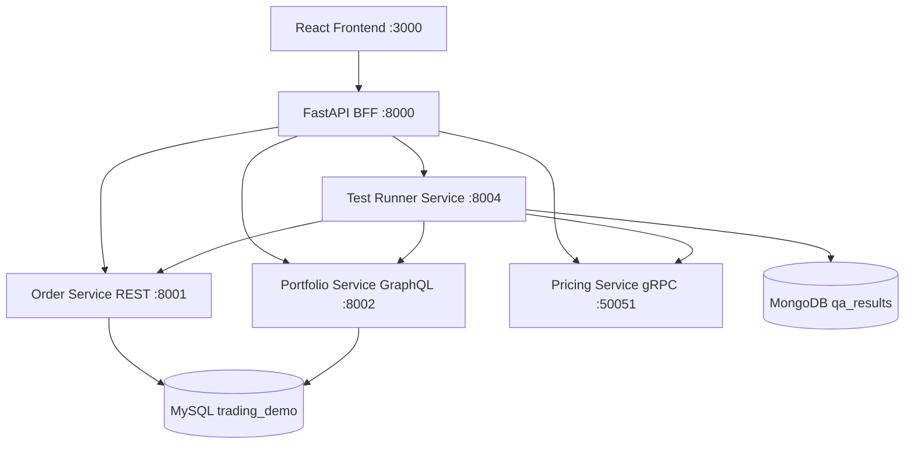

# Trading QA API Demo Platform

A full-stack microservice demo system for API automation testing across REST, GraphQL, and gRPC.

The goal is a clean, demo-friendly platform rather than a real trading system. The frontend calls only the BFF. The BFF fans out to internal services and returns frontend-friendly JSON.

## Architecture



## Services

| Service | Stack | Port | Purpose |
| --- | --- | ---: | --- |
| frontend | React, Vite, TypeScript, Ant Design | 3000 | Demo dashboard and workflows |
| bff | FastAPI, httpx, grpcio | 8000 | Only frontend backend entry point |
| order-service | FastAPI, SQLAlchemy, MySQL | 8001 | REST order creation, search, cancellation |
| portfolio-service | FastAPI, Strawberry GraphQL, MySQL | 8002 | Account portfolio and risk limit |
| pricing-service | Python grpcio | 50051 | Unary and streaming price APIs |
| test-runner-service | FastAPI, pytest, MongoDB | 8004 | Runs API regression tests and stores results |
| mysql | MySQL 8 | 3306 | Business data |
| mongodb | MongoDB 7 | 27017 | Test results and API logs |

## Start

```bash
docker compose up --build
```

Then open:

- Frontend: http://localhost:3000
- BFF OpenAPI: http://localhost:8000/docs
- Order service OpenAPI: http://localhost:8001/docs
- Portfolio GraphQL: http://localhost:8002/graphql
- Test runner OpenAPI: http://localhost:8004/docs

## Demo Flow

1. Open http://localhost:3000.
2. Review dashboard metrics and latest price.
3. Open Orders and create a valid order.
4. Click Invalid Order to trigger validation failure.
5. View request and response payloads.
6. Open Portfolio and query `ACC001`.
7. Update the risk limit.
8. Open Pricing and query `LME-CA`.
9. Run the stream demo.
10. Open Test Runs and click Run API Regression.
11. Review REST, GraphQL, and gRPC case details.

## BFF APIs

The frontend should use these only:

```text
GET    /api/health
GET    /api/dashboard
GET    /api/orders
GET    /api/orders/{order_id}
POST   /api/orders
PATCH  /api/orders/{order_id}/cancel
GET    /api/portfolio/{account_id}
POST   /api/portfolio/{account_id}/risk-limit
GET    /api/pricing/{symbol}
GET    /api/pricing/{symbol}/stream-demo
POST   /api/test-runs
GET    /api/test-runs
GET    /api/test-runs/{run_id}
```

Successful BFF response:

```json
{
  "success": true,
  "data": {}
}
```

Error BFF response:

```json
{
  "success": false,
  "errorCode": "ORDER_NOT_FOUND",
  "message": "Order not found",
  "details": {}
}
```

## Sample Commands

Create a valid order through the BFF:

```bash
curl -X POST http://localhost:8000/api/orders \
  -H "Content-Type: application/json" \
  -H "Authorization: Bearer demo-token" \
  -d "{\"accountId\":\"ACC001\",\"symbol\":\"LME-CA\",\"side\":\"BUY\",\"quantity\":10,\"price\":9125.5}"
```

Create a rejected business order:

```bash
curl -X POST http://localhost:8000/api/orders \
  -H "Content-Type: application/json" \
  -d "{\"accountId\":\"ACC001\",\"symbol\":\"LME-ZN\",\"side\":\"BUY\",\"quantity\":15001,\"price\":2741.8}"
```

Query portfolio directly against GraphQL for service-level testing:

```graphql
query Portfolio($accountId: String!) {
  portfolio(accountId: $accountId) {
    accountId
    cashBalance
    riskLimit
    usedLimit
    availableLimit
    positions {
      symbol
      quantity
      averagePrice
      marketValue
    }
  }
}
```

Run the query:

```bash
curl -X POST http://localhost:8002/graphql \
  -H "Content-Type: application/json" \
  -d "{\"query\":\"query Portfolio($accountId: String!) { portfolio(accountId: $accountId) { accountId cashBalance riskLimit usedLimit availableLimit positions { symbol quantity averagePrice marketValue } } }\",\"variables\":{\"accountId\":\"ACC001\"}}"
```

Call gRPC with grpcurl:

```bash
grpcurl -plaintext -d "{\"symbol\":\"LME-CA\"}" localhost:50051 pricing.PricingService/GetPrice
```

Run regression through the BFF:

```bash
curl -X POST http://localhost:8000/api/test-runs
```

## Test Coverage

The test runner service executes pytest cases that call real services:

- REST order tests: valid create, validation failure, business rejection, get order, cancel order, not found.
- GraphQL portfolio tests: query portfolio, positions, risk limit mutation, negative risk limit error, missing account error.
- gRPC pricing tests: unary price, bid/ask invariant, mid calculation, invalid symbol, five streaming updates.

Results are written to MongoDB:

- `test_runs`
- `test_cases`
- `api_logs`

## Databases

MySQL database:

- Database: `trading_demo`
- User: `demo_user`
- Password: `demo_password`
- Tables: `orders`, `accounts`, `positions`

MongoDB database:

- Database: `qa_results`
- Collections: `test_runs`, `test_cases`, `api_logs`

Initialization scripts:

- `database/mysql/init.sql`
- `database/mongodb/init.js`

## Local Development

Install frontend dependencies:

```bash
cd frontend
npm install
npm run dev
```

Run a Python service locally after installing its requirements. For BFF, pricing-service, and test-runner-service, generate gRPC files first:

```bash
python -m grpc_tools.protoc -I proto --python_out=app/generated --grpc_python_out=app/generated proto/pricing.proto
```

Then run, for example:

```bash
uvicorn app.main:app --host 0.0.0.0 --port 8000
```

## Notes

- The React frontend calls only `http://localhost:8000/api/*`.
- Internal service URLs are configured through Docker Compose environment variables.
- gRPC reflection is enabled in pricing-service for easier demos with grpcurl.
- Authentication is intentionally omitted; the frontend sends a mock `Authorization: Bearer demo-token` header.

